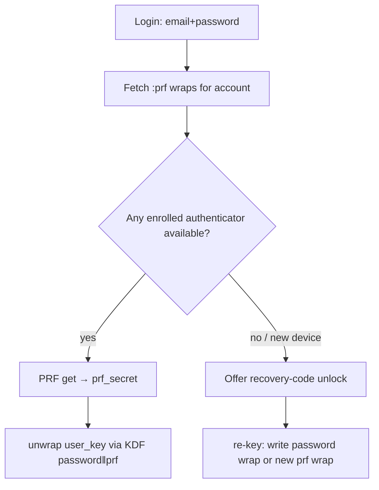

# 🔐 WebAuthn PRF — Device-Bound Wrapping Factor for `user_key`

> **Board task:** #362 · **Status:** design/scoping (phase a)
> **Relationship to ZK model:** extends [`ENCRYPTION_ARCHITECTURE.md`](./ENCRYPTION_ARCHITECTURE.md).
> Signing-key/key-transparency work (#291/#315) is **orthogonal** — signing keys
> still derive from `user_key`; this only changes how `user_key` is *unwrapped*.

## 1. Goal (one sentence)

Let a user **opt in** to binding their encryption root (`user_key`) to a device's
secure enclave/TPM via the **WebAuthn PRF extension**, so that after enrollment
`user_key` requires **password AND enrolled device** — without ever giving the
server key material (preserve **I6**) and without losing the zero-knowledge
recovery path.

## 2. Current model (the wrapping seam)

Today `user_key` is unwrapped in exactly one place, client-side
(`assets/js/hooks/login-hook.js`), from the server-stored `key_hash` blob:

```
key_hash = salt "$" secretbox(user_key, session_key)
session_key = Argon2id(password, salt)          # WASM KDF
user_key    = secretbox_open(ciphertext, session_key)
```

Server-side mirror: `Mosslet.Encrypted.Utils.generate_key_hash/2` and
`decrypt_key_hash/2` (`lib/mosslet/encrypted/utils.ex`). The server stores only
the opaque `key_hash` (`User.key_hash`) and **never** sees `session_key` or
`user_key`.

There is a **second, independent unwrap door**: the ZK recovery key. A
high-entropy (256-bit) recovery secret encrypts the user's private key blob
(`encrypted_recovery_private_key`), verified server-side by an Argon2 hash of the
secret (`recovery_key_hash`). See `Accounts.verify_recovery_key/2` and
`reset_password_with_recovery/5`.

So `user_key` is reachable today via an **OR gate**:

```
user_key  ⇐  Argon2id(password)      # password door
          OR recovery_secret         # recovery door (256-bit)
```

## 3. THE central constraint — OR → AND (why the naive design is worthless)

Unwrap paths combine as an **OR gate**: an attacker takes the **weakest** door.

A naive "keep the password-only wrap **and** *add* a PRF wrap" design adds
**zero** root security — the attacker just walks through the unchanged password
door. The password (human-chosen, brute-forceable) remains the ceiling.

**To genuinely raise the ceiling, enrollment must DELETE the password-only wrap
and flip OR → AND.** After opt-in, `user_key` is unlockable **only** by:

```
user_key  ⇐  KDF(password ‖ prf_output)   # password AND enrolled device
          OR recovery_secret               # 256-bit, user-held, ZK, offline
```

- `KDF(password ‖ prf_output)` — needs **both** the password **and** a PRF
  evaluation from an enrolled authenticator (hardware-bound, non-exportable).
  Neither half alone suffices.
- `recovery_secret` — the **only** remaining fallback for device loss. Its
  256-bit entropy is the **new floor** — not human-brute-forceable like a
  password.

"Optional" means **opt-in per account, never both doors open**:

| Cohort | Password door | Recovery door | Device+password door |
|---|---|---|---|
| **Non-enrolled** (default) | ✅ `Argon2id(password)` | ✅ | — |
| **Enrolled** | ❌ **deleted** | ✅ | ✅ `KDF(password ‖ prf)` |

Non-enrolled users are **unchanged**. Enrolled users are **strictly stronger**.
The change **never weakens anyone**.

## 4. Hard prerequisites & wrinkles

1. **Recovery code is MANDATORY before PRF enrollment.** Once the password-only
   wrap is deleted, the confirmed recovery code is the *only* device-loss
   fallback. Enrollment MUST be gated on `recovery_key_hash` being present and
   **freshly confirmed** in this session.
2. **Multi-device = multiple AND-wraps.** Each authenticator gets its **own**
   `KDF(password ‖ prf)` wrap of the *same* `user_key`. A new device unlocks via
   the recovery code **or** an already-enrolled **synced** passkey, then enrolls
   and writes its own wrap.
   - **Synced-passkey ecosystems** (iCloud Keychain, Google Password Manager)
     keep the PRF output **stable across synced copies within one ecosystem** —
     so one wrap covers every Apple device sharing that passkey. PRF is **not**
     stable across ecosystems (Apple ↔ Google) → those need separate wraps.
3. **Un-enroll / lost-device must not brick the user.** Removing the last
   enrolled authenticator MUST re-materialize a password-only wrap (OR-gate
   restored) — or force a recovery-code re-key. Users can always get back in.
4. **Capability-gated, additive.** Chrome/Edge ✅, Safari 18+ ✅, Firefox partial.
   PRF is a **progressive enhancement** — never a hard dependency. If the
   extension is unavailable, the enrollment CTA is simply hidden/disabled and the
   existing password + recovery flow is untouched.

## 5. Storage schema (proposed)

`user_key` wraps become a **collection of per-authenticator blobs**, plus an
optional password-only wrap that exists **iff** no authenticator is enrolled.

New table `user_key_wraps` (one row per unlock door):

| column | type | notes |
|---|---|---|
| `id` | uuid | |
| `user_id` | uuid FK | |
| `kind` | enum `:password` \| `:prf` | exactly one `:password` row when non-enrolled; zero when enrolled |
| `wrapped_user_key` | `Encrypted.Binary` | `secretbox(user_key, wrapping_key)` — opaque to server |
| `wrap_salt` | `:string` | KDF salt for this wrap (base64) |
| `credential_id` | `Encrypted.Binary` (nullable) | WebAuthn credential id (`:prf` rows) |
| `prf_salt` | `:string` (nullable) | per-credential PRF eval salt (base64) |
| `label` | `Encrypted.Binary` (nullable) | user-facing device nickname, sealed under `user_key` |
| `ecosystem_hint` | `:string` (nullable) | `"apple" \| "google" \| "cross-platform"` (best-effort, non-authoritative) |
| `last_used_at` | `:utc_datetime` | |
| `inserted_at` / `updated_at` | | |

Invariants (enforced server-side + partial unique index):
- **Enrolled** (`count(:prf) >= 1`) ⇒ **no** `:password` row exists.
- **Non-enrolled** ⇒ **exactly one** `:password` row.
- Recovery door is unchanged (existing `User` fields) and always present as the
  ZK fallback.

> Migration note: existing `User.key_hash` **is** the current password wrap.
> Phase (c) either (i) reads it as the implicit `:password` wrap, or (ii)
> backfills a `:password` row. Keep `key_hash` authoritative until backfill is
> proven; do not delete it until the wraps table is the single source of truth.

The server remains a **dumb store**: every `wrapped_user_key`, `prf_salt`, and
`wrap_salt` is opaque. The server enforces *invariants and gates* (recovery
present, don't-brick), never key material (**I6** preserved).

## 6. Client crypto — combining two secrets (the ~10%)

PRF returns raw bytes (`prf_output`). We must combine them with the
password-derived key into **one** wrapping key with **auditable domain
separation**. We use **RFC 5869 HKDF-SHA512** (Extract-then-Expand, HMAC over
**SHA-2**-SHA512 — *not* SHA3) over `password_key ‖ prf_output`:

```
wrapping_key = HKDF-SHA512(
  salt = wrap_salt,                 # Extract
  ikm  = password_key ‖ prf_output,
  info = "mosslet/user_key-wrap/v1", # Expand (domain separation)
  L    = 32,                         # secretbox key length, no truncation
)
user_key_wrap = secretbox(user_key, wrapping_key)
```

- `password_key = Argon2id(password, wrap_salt)` — reuses the existing WASM KDF.
- `prf_output` = WebAuthn PRF output (32 bytes) from
  `navigator.credentials.get({ publicKey: { extensions: { prf: { eval: { first: prf_salt }}}}})`.
- The combine is a single audited `hkdfSha512(salt, ikm, info, length)` call
  from metamorphic-crypto (v0.10.0), byte-identical to `@noble/hashes` /
  WebCrypto HKDF-SHA-512, and shared by the browser WASM and the server NIF.

`prf_output` bytes never leave the browser; only the resulting opaque
`wrapped_user_key` is persisted.

## 7. Threat model (deltas from today)

| Attacker capability | Non-enrolled (today) | Enrolled (after) |
|---|---|---|
| Full server DB dump | Offline brute-force of password → `user_key` | `KDF(password‖prf)` wrap useless without the device's PRF; must ALSO steal 256-bit recovery secret (not brute-forceable) |
| Phished/known password | Full compromise | **Insufficient** — still needs the enrolled device |
| Stolen unlocked device | (device holds no persistent `user_key` beyond session) | Needs password too (PRF alone ≠ `user_key`) |
| Lost device | Password still works | Recovery code re-keys; un-enroll restores password door |
| Malicious server | Cannot derive keys (**I6**) | Cannot derive keys (**I6**) — unchanged |

Net: enrollment **removes the human-password brute-force ceiling** as a
standalone attack, and the residual offline attack surface becomes the 256-bit
recovery secret.

## 8. Flows

```mermaid
%% title: PRF enrollment (single device)
flowchart TD
  A[User opts in] --> B{Recovery code confirmed this session?}
  B -- no --> C[Force recovery-code setup+confirm] --> B
  B -- yes --> D[PRF capability check]
  D -- unsupported --> E[Hide/disable CTA — no change]
  D -- supported --> F[credentials.create + get PRF output]
  F --> G[wrapping_key = HKDF(password_key ‖ prf_secret)]
  G --> H[write :prf wrap]
  H --> I[DELETE :password wrap  ← OR→AND flip]
```

**Ordered anti-brick invariant (MUST hold):**

1. **Client proves round-trip BEFORE enroll.** After building `wrapped_user_key`,
   the client does a **second** PRF `get()` with the stored `prf_salt`, re-derives
   the wrapping key, and asserts `unwrap(wrapped_user_key) == user_key`. This
   proves the credential deterministically reproduces the PRF across ceremonies
   (the real unlock path). Only then does it call `prf_enrolled`. If the proof
   fails, it mutates **nothing** server-side. The server **cannot** perform this
   check (**I6** — it holds no keys).
2. **Server insert-:prf-then-delete-:password is atomic.** `enroll_prf_wrap`
   inserts the `:prf` wrap and deletes the `:password` wrap inside **one**
   transaction, in that order. A failed `:prf` insert rolls back the whole
   transaction, so the `:password` door **always survives** a failed enroll —
   the account can never end up with zero unlock doors.



## 9. Sequencing (board sub-tasks under #362)

- **(a) DONE — this doc.** Design, threat model, storage schema, AND-gate
  constraint captured in-repo.
- **(b) Recovery-code-mandatory gate.** Block PRF enrollment unless recovery is
  confirmed fresh. Tests: gate enforced, timing-safe.
- **(c) Single-device happy path.** Migration + `user_key_wraps` schema +
  `Accounts` functions + enroll/unlock/un-enroll LiveView + JS PRF glue.
  Enrollment deletes password wrap; un-enroll restores it.
- **(d) Multi-device + synced-passkey.** Multiple `:prf` wraps; new-device
  bootstrap via recovery or synced passkey; ecosystem-hint handling.
- **(e) UX, honest disclosure copy, tests, `browser_eval`.** Settings UI,
  device list, capability messaging.

## 10. Test coverage plan

- **ExUnit (`Accounts`):** wrap invariants (enrolled ⇒ no password wrap;
  un-enroll restores it), recovery-gate enforcement, don't-brick guarantees,
  `transaction_on_primary` wrapping. **Anti-brick ordering:** a failed `:prf`
  insert (invalid `prf_changeset` attrs) leaves the existing `:password` wrap
  intact (account not bricked).
- **LiveViewTest:** settings enroll/un-enroll flows keyed off DOM IDs; CTA hidden
  when recovery absent. A client "verification failed" path leaves the password
  door intact (server never receives a `prf_enrolled` event).
- **JS unit:** RFC 5869 HKDF-SHA512 combine determinism + domain separation;
  wrap / unwrap round-trip; PRF-unavailable fallback.
- **`browser_eval`:** capability gating visible/invisible; enroll happy path
  (incl. the verify-before-delete second PRF ceremony) where the platform
  authenticator is virtualized via a CDP virtual authenticator.

## 10a. Password change (MUST handle — enrolled users)

`user_key` is **immutable** across a password change — only its wrap changes
(that's why the private key survives password changes today; see
`User.put_new_key_hash_and_key_pair/3`, which re-derives `key_hash` from the
*same* `user_key`).

- **Non-enrolled:** unchanged. Server re-derives the single `:password` wrap
  (`key_hash`) from the new password. ✅
- **Enrolled (⚠ hazard):** the account has **no** `:password` wrap by design. The
  legacy server-side re-derivation path would *silently re-create* a
  password-only `key_hash` door — **reopening the weak OR gate and un-enrolling
  the user without consent.** This MUST be prevented.

Correct enrolled-user behaviour: a password change re-wraps **each `:prf` wrap**
client-side as `secretbox(user_key, HKDF(new_password_key ‖ prf_output))`. This
requires an enrolled device to be **present at change time** (to evaluate PRF),
exactly like unlock. If no enrolled device is available, the user changes their
password through the **recovery-code re-key** path instead (which already
re-materializes wraps). The server-side password-change path must therefore skip
writing a `:password` wrap whenever `prf_enrolled?/1` is true, and accept the
browser-supplied re-wrapped `:prf` blobs instead.

> This is a first-class task for phase (c)/(d), not an afterthought. Answer to
> "will password change still work?": **yes** — non-enrolled unchanged; enrolled
> users re-wrap on-device (or via recovery), never falling back to a weak
> password-only door.

> **Status (board #368): implemented.**
> - Server: `User.put_new_key_hash_and_key_pair/3` skips the `key_hash`
>   re-derivation whenever `opts[:prf_enrolled]` is true (both `:change_password`
>   and `:reset_password`). `Accounts.update_user_password/4` detects enrollment,
>   sets that flag, and routes to an atomic path
>   (`update_user_password_prf_enrolled/3`) that — in one `transaction_on_primary`
>   — updates `hashed_password`, replaces EVERY `:prf` wrap's opaque
>   `wrapped_user_key`, and drops tokens. It refuses a partial re-wrap
>   (`{:error, :prf_rewraps_mismatch}`) so no device is left wrapped under the old
>   password. `Accounts.list_prf_rewrap_params/1` serves the (opaque) per-wrap
>   params. `reset_user_password/3` sets the same flag defensively.
> - Client: `assets/js/hooks/prf-password-change-hook.js` re-wraps each `:prf`
>   wrap under the new password on-device (`evaluatePrf` → `Argon2id(new_pw,
>   wrap_salt)` → `combineSecrets` → `secretbox`), reusing `prf.js` helpers, and
>   pushes only opaque blobs (I6). `MossletWeb.EditPasswordLive` validates the
>   current password first, then drives the re-wrap before the atomic write.

## 10b. Microsoft Edge & cross-device (answer: yes, with ecosystem nuance)

Edge is Chromium — WebAuthn PRF is **supported**. The subtlety is *not* the
browser, it's **which authenticator holds the passkey and whether PRF output is
stable across devices**:

- **Windows Hello platform authenticator** (the default on Edge/Windows) is
  **TPM-bound and NOT synced**. Each Windows/Edge machine is therefore its own
  enrollment → its own `:prf` wrap. A second Edge device is reached via the
  recovery code **or** an already-enrolled synced passkey, then enrolls itself
  (multi-device, §4 / phase d). This is the *stronger* posture (hardware-bound).
- **Synced passkey providers** (a phone passkey used cross-device via hybrid
  transport, or a cross-platform manager) keep PRF **stable within that
  provider's ecosystem**, so one wrap can cover multiple Edge devices signing in
  with the same synced credential.

So: Edge works everywhere it's supported; "across Edge devices" works via the
multi-device flow (per-device wraps) and/or a synced passkey — never blocked,
never a hard dependency (capability-gated, §4).

## 11. Non-goals / invariants preserved

- **I6:** server never receives `session_key`, `prf_secret`, `user_key`, or the
  recovery secret. Only opaque wraps + Argon2 hash of recovery secret.
- No change to signing keys / key transparency (#291/#315).
- No hard browser dependency; non-enrolled experience byte-for-byte unchanged.
</content>
</invoke>
